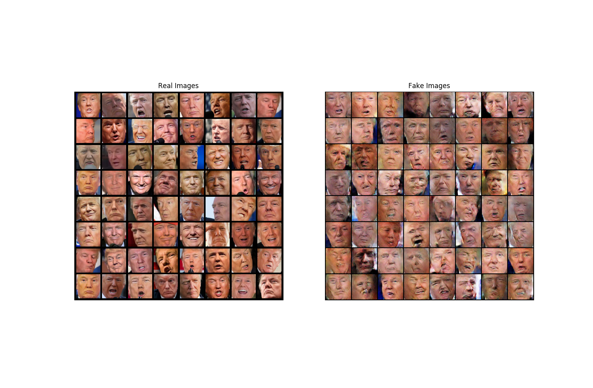

# trump_make

An experiment in DCGAN using Donald Trump's face as the dataset benchmark.
Feel free to change the parameters, add or remove Trump faces, etc.
This is more of a game to understand how GAN (and specificially Convolutional GAN) work,
and what are their challenges and results (aka `deep fakes`).

The data is under (suprise!) `data/` and was extracted from kaggle using the script `preprocess.py`.
The original dataset was found in `https://www.kaggle.com/mbkinaci/trump-photos/data` and the script
will resize pics, detect faces, extract them as pics and copy them.

Some removal is also needed (as some pics are too small, or some contain non-trump faces), or you 
can use the `data`/trump_faces` as is.

The `dcgan.py` has params and hyper-params, and you can play freely with it, getting different
results. This is a game between two networks:
- The Generator (aka `G`) will try to generate better and better fakes
- The Discriminator (aka `D`) will try to detect fakes as best as possible
- When they reach equilibrium, e.g., when `G` generates good fakes which `D` can't tell apart from
  reals, then you should be happy. I haven't gotten there yet.

You can edit the `G` class as I've added `LeakyReLU` instead of `ReLU` and the complexity of the
network may need to be increased for better results.

Training with `ADAM` seems to work, `SGD` provided worse results for some reason (I usually get
better results with `SGD` in image classification).

Please note the code is taken from the `DCGANN` example from PyTorch with minor modifications to
suit my needs.

At some point I plan on adding `tensorboard` support instead of `matplotlib` and mayb trying
slightly different achitectures for the `G` network.

If you fancy, send me a *pr* and if everything is OK I'll accept it.
